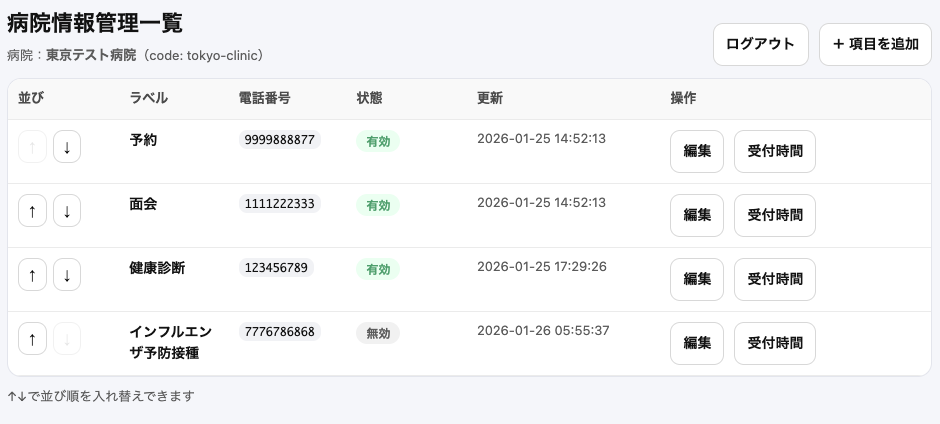
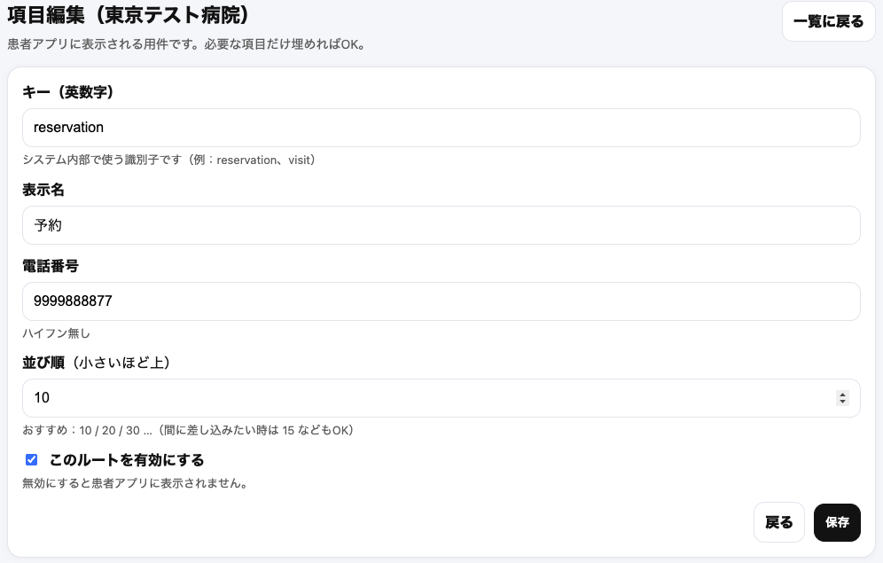
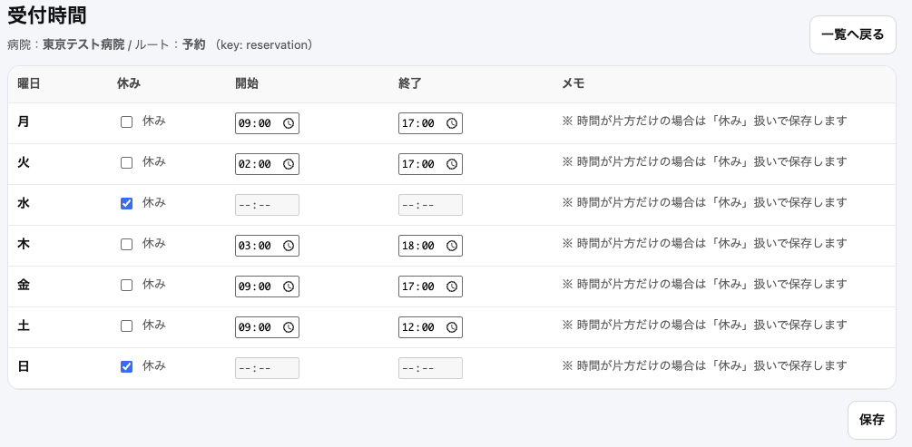

# Dux Call（病院連絡支援システム）

## 0.2.0 本番デプロイ対応・管理画面ログイン実装

  

QRコードで病院を登録し、  
**「今、電話していいかどうか」が一目で分かる**  
患者向けの病院連絡支援システムです。

病院側は管理画面から

- 連絡先
- 曜日別受付時間
- 休診・例外日

を管理できます。

---

## 制作背景

病院への電話は  
「今かけていいのか分からない」という心理的ハードルが高く、  
患者・病院双方にとって負担になりがちです。

**電話前に “今の受付状況” が分かるだけで、  
不要な電話を減らせるのではないか**  
という発想から制作しました。

---

## 主な機能

### 患者向け（Webアプリ）

- QRコードで病院を登録
- 病院ごとの連絡先一覧を表示
- 各連絡先について
  - 本日受付中 / 受付外
  - 次に受付が始まる時刻  
    をリアルタイム表示
- スマートフォン実機での利用を前提とした UI

---

### 病院側（管理画面）

  

- スタッフログイン（session 管理）
- 連絡先（ルート）の追加・編集・並び替え
- 曜日別受付時間の設定

  

- 休診日・例外日の設定
- 有効 / 無効の切り替え
- 管理画面は病院スタッフのみアクセス可能

---

## 技術構成

### フロントエンド（患者向け）

- React
- Vite
- React Router（HashRouter）
- TypeScript

### バックエンド / 管理画面

- PHP 8.2
- PDO（MySQL）
- session によるログイン管理
- REST API（患者アプリ向け）

### インフラ

- さくらのレンタルサーバ
- MySQL（さくら標準）
- Apache + .htaccess

## 動作環境

- PC（Chrome）
- Android Chrome 実機  
  ※ ngrok 不要、本番 URL で直接確認可能

---

## 今後の展望

- 病院スタッフの権限分離
- 患者側のお気に入り病院管理
- 通知（受付開始の案内）
- 管理画面 UI の改善

---
